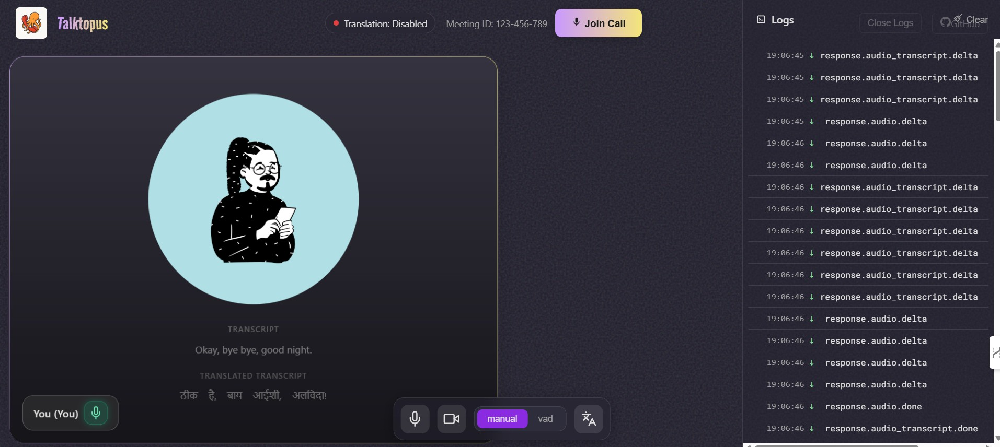

<p align="center">
  
</p>

# Talktopus Realtime Translation Web App

Talktopus is a real-time voice and translation web app built with Agora for audio/video calls and OpenAI for live translation.The app is built with vanilla JavaScript and intended for demonstration purposes only.

## Project Structure

- **realtime-server.js**: Node.js server for relaying audio and translation data between clients and OpenAI/Agora.
- **/public**
  - **realtime.html**: Main frontend HTML file for the app UI.
  - **main.js**: Handles all frontend logic (Agora integration, UI updates, translation, audio/video management).
  - **styles.css**: Styles for the app UI.
  - **assets/**: Images and avatars used in the UI.
  - **lib/**: Audio tools (wavtools) used for audio processing.

## Features
- Join/leave real-time audio/video calls (Agora)
- Live translation of speech (OpenAI Whisper/translation)
- Translation settings (choose source/target language)
- Push-to-talk and VAD (voice activity detection) modes

## Dependencies
- [Node.js](https://nodejs.org/) (v16+ recommended)
- [Agora Web SDK](https://www.agora.io/en/blog/agora-web-sdk/) (loaded via CDN in HTML)
- [OpenAI API](https://platform.openai.com/docs/api-reference)

### NPM Packages (for server)
- `ws` (WebSocket server)
- `express` (for serving static files)
- `dotenv` (for environment variables)

## Setup & Running

1. **Clone the repository**

2. **Install server dependencies**
   ```bash
   npm install ws express dotenv
   ```

3. **Configure environment variables**
   - Create a `.env` file in the root directory with your Agora and OpenAI credentials:
     ```env
     AGORA_APP_ID=your-agora-app-id
     AGORA_TOKEN=your-agora-token
     AGORA_CHANNEL=your-channel
     OPENAI_API_KEY=your-openai-api-key
     ```

4. **Start the server**
   ```bash
   node realtime-server.js
   ```
   By default, the server will serve the `/public` directory and run the relay logic.

5. **Open the app**
   - Visit [http://localhost:3000](http://localhost:3000) in your browser.

6. **Join a call**
   - Click "Join Call" and allow camera/microphone access.
   - Open another browser/device to join as a second user for testing.

## Notes
- All UI and logic is in `/public/realtime.html`, `/public/main.js`, and `/public/styles.css`.
- The app is designed for demo and prototyping purposes. For production, secure your API keys and use HTTPS.
---


# App Screenshot


